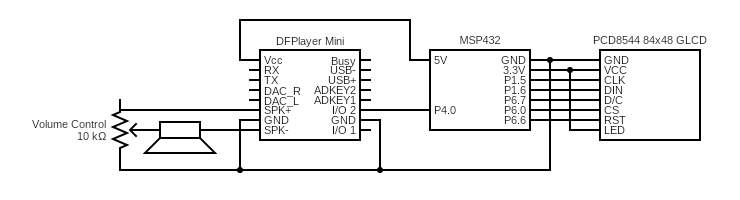

# Bad MSP432P401R!!
[Bad Apple!!](https://archive.org/details/bad_apple_is.7z) ported to the [Texas Instruments LaunchPad MSP432P401R](https://docs.rs-online.com/3934/A700000006811369.pdf), a [black/white LCD](https://www.sparkfun.com/products/10168), and a [DFPlayer Mini](https://wiki.dfrobot.com/DFPlayer_Mini_SKU_DFR0299) clone.

[Demo video](https://www.youtube.com/watch?v=bgwLhES1YYo)

Video is 32x24 @ 10 fps (upscaled to 64x48), "compressed" losslessly into 2x4 (actually 4x8) characters. Since there just so happen to be 256 different 2x4 characters, one frame is only 96 bytes long. The whole program ends up using 214K of the LaunchPad's 256K. Ironically, my attempt at run-length encoding made the frame array larger (too big for the board). With more time, I would probably experiment more with compression as an attempt to get proper 64x48, but this minimum viable product is enough for the standards I wanted to meet.

I wanted to use the serial mode of the DFPlayer, but I could not get the MSP432 to send it valid data. Maybe I have the baud rate wrong. Ultimately it doesn't matter, since the DFPlayer also has a "next track button" pin.

Oh right, I should probably mention that this is my final project for ECEN 260 (Microprocessor-Based System Design) at Brigham Young University-Idaho. I have to turn in the hardware after I'm done, so I won't be able to improve this.

And here's a schematic:

